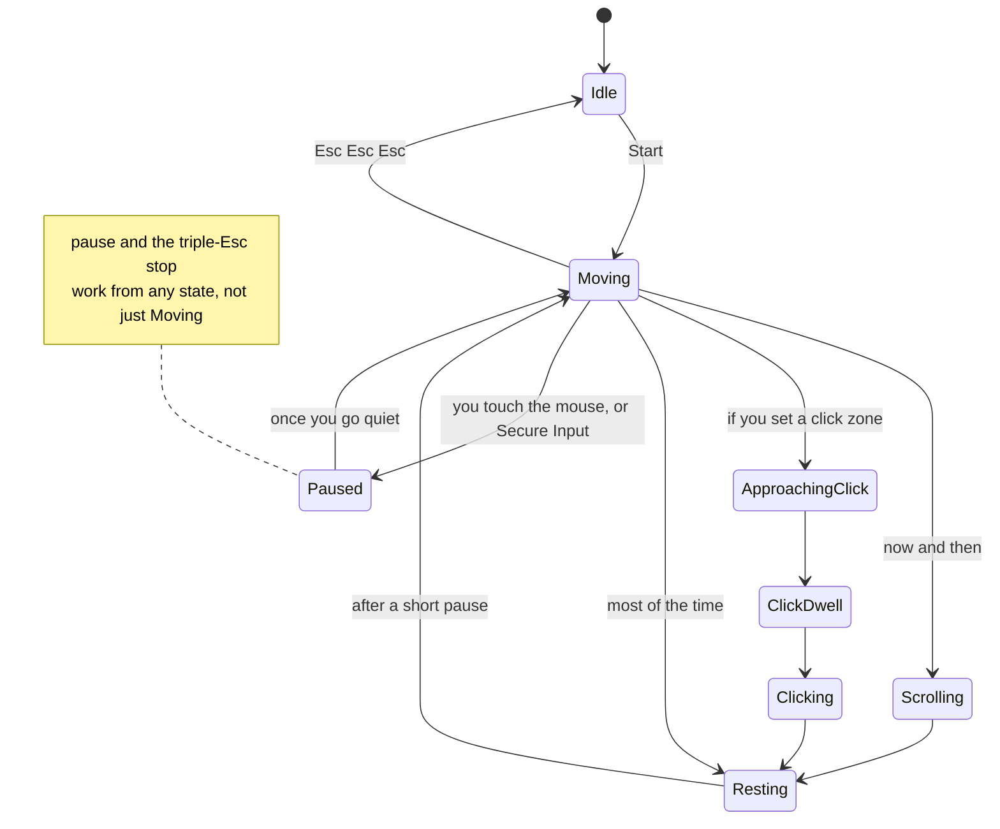
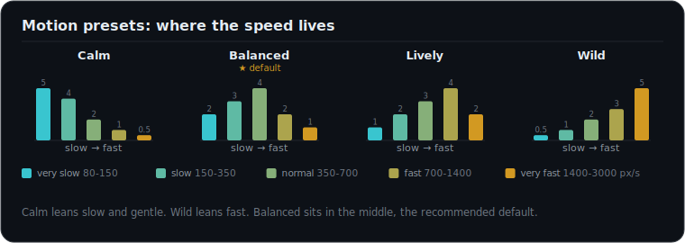

<div align="center">

# Cursor+



**A macOS menu bar app that keeps your Mac awake by moving the cursor the way a hand would, not the way a metronome would.**


</div>

Cursor+ keeps your Mac looking active by nudging your real mouse cursor around. Not a twitchy jiggle, actual motion: it picks a spot, picks a speed, and follows a curved path there, with a faint hand tremor and the occasional slow scroll. The moment you touch your own mouse or keyboard it gets out of the way, and it only comes back once you have gone quiet. You can kill it any time by tapping Esc three times quickly.

Out of the box it only moves and scrolls. If you want, you can draw **click areas**, rectangles you place on screen, and it will every so often curve into one and click a spot inside it. It only ever clicks inside the rectangles you draw, never random empty space, so put them on things that are safe to click.

> [!NOTE]
> This is a personal tool for your own machine. It synthesizes input and listens for the Esc stop gesture, so do not run it on a work-managed (MDM) Mac.

## What it actually does, in a loop

Moving the cursor is what resets the system idle timer, which is the whole reason this works. Cursor+ runs a small state machine that wanders, sometimes scrolls, sometimes visits a click zone, then rests, over and over, and hands control straight back to you the instant you touch anything.



Each move samples a speed class, from very slow to very fast, then a real velocity inside it, and follows a curved path with a band-limited 8 to 12 Hz tremor layered on, the same frequency as a real hand. Four presets shift where that speed lives.

<div align="center">

</div>

## How it knows its own moves, and how it stays safe

A jiggler that pauses when you touch the mouse has a problem: it has to tell its own motion apart from yours, or it will pause on itself and never move. Cursor+ does this out of band. It keeps a small private log of every move it just posted, and the kill switch checks against that log instead of stamping a marker on the events. It never tags its own output. The one thing no app can hide is the process ID macOS attaches to every posted event, but nothing Cursor+ itself adds gives the motion away.

- It only clicks inside the areas you define, never random or empty space. With no areas set it just moves and scrolls.
- It auto pauses the instant you use the mouse or keyboard, and comes back once you go idle.
- It freezes while a password field or the lock screen is focused, so the Esc kill gesture is never in doubt.
- The triple Esc kill switch runs on its own self-healing global tap with a backup monitor, completely separate from the motion. Cursor+ never synthesizes key events, so nothing it does can interfere with the stop.

## Build

You need the Swift toolchain on macOS 14 or newer. I built and tested it on macOS 26 on Apple Silicon.

```bash
./scripts/build_app.sh
open "Cursor+.app"
```

A cursor icon shows up in your menu bar. Running `swift build` on its own only gives you the bare binary, the menu bar behavior needs the assembled `.app`. To make the Accessibility grant survive rebuilds, sign with a stable identity. The instructions are at the top of [`scripts/build_app.sh`](scripts/build_app.sh).

## First run and permissions

macOS will ask for permission and deep link you to the right pane:

**System Settings, Privacy and Security, Accessibility**, then turn on **Cursor+**.

That one grant covers moving the cursor, scrolling, and watching for your input. If the menu says it needs permission or that the kill switch is unavailable, finish the grant and relaunch.

## Using it

Click the menu bar icon:

- **Start and Stop** turn it on and off. Stop is always a reliable kill.
- **Motion speed**: Calm, Balanced, Lively, Wild.
- **Wander interval**: 10 to 20s, 20 to 40s, 30 to 60s, or 60 to 120s, how long it roams before resting.
- **Occasional scrolling** lets it emit a rare slow scroll.
- **Human idle pauses** drop short, natural pauses between bursts.
- **Occasional long pauses** is off by default. Turn it on and it will rarely take a 30 to 90 second break. Heads up: during a long pause the Mac can read as away to presence based status, even though the display stays awake.
- **Click defined areas** toggles whether it clicks inside your zones at all.
- **Add or Edit click area** opens the overlay editor: drag to add a rectangle, click to select, drag the handles to resize, Delete to remove, Esc or Return when done.
- **Clear click areas** removes all of them.
- **Prevent display sleep** also holds the screen awake.

To stop at any time, tap Esc three times quickly, or click Stop.

## How it is put together

| File | What it does |
|---|---|
| `Sources/CursorPlus/InputEngine.swift` | posts real cursor moves and scrolls with CGEvent, with hardware consistent deltas |
| `Sources/CursorPlus/MovementEngine.swift` | speed classes, velocity sampling, the curved path geometry, tremor, and the scroll player |
| `Sources/CursorPlus/StateMachine.swift` | the rhythm: wander, maybe scroll, maybe visit a click zone, rest, repeat |
| `Sources/CursorPlus/AutoPause.swift`, `SyntheticInputLog.swift` | hands control back the moment you touch input, and tells its own motion from yours |
| `Sources/CursorPlus/KillSwitch.swift` | the self-healing global tap behind the triple Esc stop |
| `Sources/CursorPlus/ClickZone.swift`, `ClickZoneEditor.swift` | the click areas and the full screen editor for drawing them |

## License

[MIT](LICENSE). Copyright 2026 Ahmed Ufuk Serce. Personal tool. Whatever you do with it is on you, including running it somewhere it is actually allowed.
